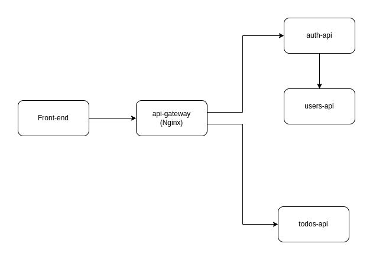

# Example microservice app

This is an example of web application comprising of several components communicating to each other. In other words, this is an example of microservice app. Why is it better than many other examples? Well, because these microservices are written in different languages. This approach gives you flexibility for running experiments in polyglot environment.

The app itself is a simple TODO app that additionally authenticates users. I planned to add some admin functionality, but decided to cut the scope and add it later if needed.

## Components

1. [Frontend](/frontend) part is a Javascript application, provides UI. Created with [VueJS](http://vuejs.org)
2. [Auth API](/auth-api) is written in Go and provides authorization functionality. Generates JWT tokens to be used with other APIs.
3. [TODOs API](/todos-api) is written with NodeJS, provides CRUD functionality ove user's todo records.
4. [Users API](/users-api) is a Spring Boot project written in Java. Provides user profiles. Does not provide full CRUD for simplicity, just getting a single user and all users.
Take a look at the components diagram that describes them and their interactions.
5. [api-gateway](/api-gateway) is the glue that binds it all. 

## How to start

As described above, this app has 4 different services. As visible in diagram above, project dependencies can be described as follows:
1. There is a Users Service, which does not have any dependency and must be deployed first.
2. Auth service which depends on Users Service. This must be deployed after Users Service.
3. Todos Service which depends on Auth Service. This must be deployed after Auth Service.
4. Frontend which depends on Auth Service and Todo Service. Build the front-end with its respective command and store artifacts generated for later steps.
5. api-gateway which depends on all other services. This must be deployed last.

The guide on how to build and deploy each service is written in the respective component's README.md file.

